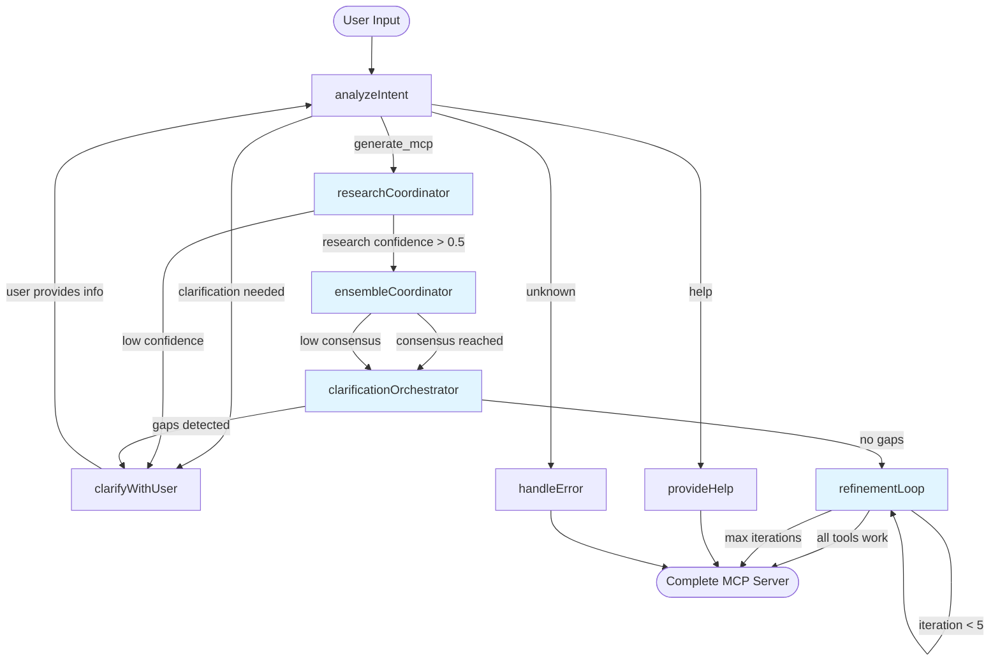

# Architecture Documentation

Technical architecture and design details for MCP Everything.

## Table of Contents
- [System Overview](#system-overview)
- [Backend Architecture](#backend-architecture)
- [Frontend Architecture](#frontend-architecture)
- [Database Design](#database-design)
- [LangGraph State Machine](#langgraph-state-machine)
- [AI Integration](#ai-integration)
- [Communication Patterns](#communication-patterns)
- [Security Architecture](#security-architecture)

## System Overview

MCP Everything uses a modern, AI-first architecture with three main layers:

```
┌─────────────────────────────────────────────────────────┐
│                    Frontend Layer                        │
│  Angular 20 • LibreChat Design • SSE Client • Responsive │
└─────────────────────────────────────────────────────────┘
                            ↓
                         SSE/HTTP
                            ↓
┌─────────────────────────────────────────────────────────┐
│                    Backend Layer                         │
│  NestJS • LangGraph • Claude Haiku • GitHub API • Docker │
└─────────────────────────────────────────────────────────┘
                            ↓
                      PostgreSQL
                            ↓
┌─────────────────────────────────────────────────────────┐
│                    Data Layer                            │
│  Conversations • Checkpoints • User Sessions • Generated │
└─────────────────────────────────────────────────────────┘
```

### Core Principles

1. **AI-First**: Natural language understanding over rigid APIs
2. **Conversational**: Multi-turn dialogue with context preservation
3. **Local-First**: Docker builds locally for fast iteration
4. **Type-Safe**: End-to-end TypeScript with strict mode
5. **Scalable**: Designed for growth from MVP to enterprise

## Backend Architecture

### Service Layer Organization

```
packages/backend/src/
├── orchestration/
│   ├── graph.service.ts              # LangGraph orchestration
│   ├── state.types.ts                # State machine types
│   └── nodes/                        # Individual node implementations
│
├── chat/
│   ├── chat.controller.ts            # HTTP/SSE endpoints
│   ├── chat.service.ts               # Chat business logic
│   └── chat.module.ts                # Chat module definition
│
├── github/
│   ├── github-analysis.service.ts    # Repository analysis
│   ├── octokit.service.ts            # GitHub API client
│   └── types/                        # GitHub-specific types
│
├── generation/
│   ├── mcp-generation.service.ts     # MCP server generation
│   ├── tool-discovery.service.ts     # Tool identification
│   ├── code-execution.service.ts     # Validation with isolated-vm
│   └── templates/                    # Generation templates
│
├── database/
│   ├── entities/
│   │   ├── conversation.entity.ts    # Conversation model
│   │   └── conversation-memory.entity.ts  # LangGraph checkpoints
│   ├── migrations/                   # Database migrations
│   └── database.module.ts            # TypeORM configuration
│
└── common/
    ├── config/                       # Configuration management
    ├── utils/                        # Shared utilities
    └── guards/                       # Authentication guards
```

### Core Services

#### GraphOrchestrationService
**Purpose**: Orchestrates the LangGraph state machine for conversational AI

**Key Methods**:
```typescript
class GraphOrchestrationService {
  // Execute graph with streaming updates
  async *executeGraph(
    sessionId: string,
    userMessage: string
  ): AsyncGenerator<GraphState>;

  // Build LangGraph workflow
  private buildGraph(): CompiledStateGraph;

  // Node implementations
  private async analyzeIntent(state: GraphState): Promise<GraphState>;
  // NEW: Ensemble architecture nodes
  private async researchCoordinator(state: GraphState): Promise<GraphState>;
  private async ensembleCoordinator(state: GraphState): Promise<GraphState>;
  private async clarificationOrchestrator(state: GraphState): Promise<GraphState>;
  private async refinementLoop(state: GraphState): Promise<GraphState>;
  // Supporting nodes
  private async clarifyWithUser(state: GraphState): Promise<GraphState>;
  private async provideHelp(state: GraphState): Promise<GraphState>;
  private async handleError(state: GraphState): Promise<GraphState>;
}
```

#### GitHubAnalysisService
**Purpose**: Analyzes GitHub repositories using Octokit (used by ResearchService)

**Key Methods**:
```typescript
class GitHubAnalysisService {
  // Get repository metadata
  async getRepository(url: string): Promise<GitHubRepo>;

  // Analyze repository structure
  async analyzeStructure(repo: GitHubRepo): Promise<RepoAnalysis>;

  // Extract README content
  async getReadme(repo: GitHubRepo): Promise<string>;

  // Get primary language and frameworks
  async detectTechStack(repo: GitHubRepo): Promise<TechStack>;
}
```

#### ResearchService (NEW - Ensemble Architecture)
**Purpose**: Input-agnostic research coordinator supporting 5 input types

**Input Types Supported**:
- GitHub URLs (`https://github.com/owner/repo`)
- Website URLs (`https://example.com`)
- Documentation URLs (`https://docs.example.com/api`)
- Service names (`"Stripe API"`, `"Express.js"`)
- Natural language (`"I need to process payments"`)

**Key Methods**:
```typescript
class ResearchService {
  // Main entry point - classifies input and routes to appropriate strategy
  async conductResearch(state: GraphState): Promise<ResearchPhase>;

  // Classify user input into one of 5 types
  private async classifyInput(userInput: string): Promise<InputClassification>;

  // Research strategies per input type
  private async researchFromGitHub(githubUrl: string): Promise<ResearchPhase>;
  private async researchFromWebsite(url: string): Promise<ResearchPhase>;
  private async researchFromServiceName(serviceName: string): Promise<ResearchPhase>;
  private async researchFromIntent(intent: string): Promise<ResearchPhase>;
}
```

#### EnsembleService (NEW - Ensemble Architecture)
**Purpose**: Parallel reasoning with 4 specialist agents + weighted voting

**Specialist Agents**:
- **Architect Agent**: Overall system design and architecture patterns
- **Security Agent**: Security best practices and vulnerability detection
- **Performance Agent**: Performance optimization and scalability
- **MCP Specialist Agent**: MCP protocol compliance and best practices

**Key Methods**:
```typescript
class EnsembleService {
  // Orchestrate all 4 agents in parallel
  async orchestrateEnsemble(state: GraphState): Promise<EnsembleResults>;

  // Weighted voting to reach consensus
  private async performWeightedVoting(perspectives: AgentPerspective[]): Promise<Consensus>;

  // Resolve conflicts between agents
  private async resolveConflicts(conflictingRecommendations: any[]): Promise<Resolution>;
}
```

#### ClarificationService (NEW - Ensemble Architecture)
**Purpose**: AI-powered gap detection and iterative clarification

**Key Methods**:
```typescript
class ClarificationService {
  // Detect knowledge gaps from research and ensemble results
  async orchestrateClarification(state: GraphState): Promise<ClarificationResult>;

  // AI-powered gap detection
  private async detectKnowledgeGaps(state: GraphState): Promise<KnowledgeGap[]>;

  // Formulate clarification questions
  private async formulateQuestions(gaps: KnowledgeGap[]): Promise<ClarificationQuestion[]>;
}
```

#### RefinementService (NEW - Ensemble Architecture)
**Purpose**: Generate-Test-Refine loop until all tools work (max 5 iterations)

**Key Methods**:
```typescript
class RefinementService {
  // Main refinement loop
  async refineUntilWorking(state: GraphState): Promise<RefinementResult>;

  // Generate MCP server code
  private async generateMcpServer(state: GraphState): Promise<GeneratedCode>;

  // Test generated code with Docker
  private async testGeneratedCode(code: GeneratedCode): Promise<TestResults>;

  // AI-powered failure analysis
  private async analyzeFailures(testResults: TestResults): Promise<FailureAnalysis>;

  // Apply fixes based on analysis
  private async applyFixes(code: GeneratedCode, analysis: FailureAnalysis): Promise<GeneratedCode>;
}
```

#### McpTestingService (NEW - Ensemble Architecture)
**Purpose**: Docker-based MCP server validation with comprehensive test coverage

**Key Methods**:
```typescript
class McpTestingService {
  // Test MCP server in isolated Docker container
  async testMcpServer(generatedCode: GeneratedCode, options?: TestOptions): Promise<McpServerTestResult>;

  // Individual tool testing
  private async testTool(toolName: string, container: Docker.Container): Promise<ToolTestResult>;

  // Build and validate MCP server
  private async buildInDocker(generatedCode: GeneratedCode): Promise<Docker.Container>;
}
```

#### McpGenerationService
**Purpose**: Generates complete MCP server code (used by RefinementService)

**Key Methods**:
```typescript
class McpGenerationService {
  // Generate complete MCP server
  async generateMCPServer(
    analysis: RepoAnalysis,
    tools: McpTool[]
  ): Promise<GeneratedServer>;

  // Validate generated code
  async validateCode(code: string): Promise<ValidationResult>;

  // Package server files
  async packageServer(server: GeneratedServer): Promise<string>;
}
```

### NestJS Module Structure

```typescript
@Module({
  imports: [
    TypeOrmModule.forRoot(databaseConfig),
    ConfigModule.forRoot({ isGlobal: true }),
    ChatModule,
    OrchestrationModule,
    GitHubModule,
    GenerationModule,
  ],
})
export class AppModule {}
```

## Frontend Architecture

### Component Organization

```
packages/frontend/src/app/
├── core/
│   ├── services/
│   │   ├── chat.service.ts           # Chat API integration
│   │   ├── sse.service.ts            # Server-Sent Events
│   │   └── session.service.ts        # Session management
│   ├── guards/
│   └── interceptors/
│
├── features/
│   ├── chat/                         # Main chat interface
│   │   ├── chat.component.ts
│   │   ├── chat.component.html
│   │   ├── chat.component.scss
│   │   └── chat.module.ts
│   │
│   ├── explore/                      # Browse generated servers
│   │   ├── explore.component.ts
│   │   ├── explore.component.html
│   │   ├── explore.component.scss
│   │   └── explore.module.ts
│   │
│   └── account/                      # User settings
│       ├── account.component.ts
│       ├── account.component.html
│       ├── account.component.scss
│       └── account.module.ts
│
├── shared/
│   ├── components/                   # Reusable components
│   ├── directives/                   # Custom directives
│   └── pipes/                        # Custom pipes
│
├── app.component.ts                  # Root component
├── app-routing.module.ts             # Routing configuration
└── app.module.ts                     # Root module
```

### State Management

**Session Management**:
```typescript
export class SessionService {
  private sessionId: string;

  // Get or create browser session
  getOrCreateSessionId(): string {
    const stored = localStorage.getItem('mcp-session-id');
    if (stored) return stored;

    const newId = uuidv4();
    localStorage.setItem('mcp-session-id', newId);
    return newId;
  }

  // Clear session
  clearSession(): void {
    localStorage.removeItem('mcp-session-id');
  }
}
```

**SSE Connection**:
```typescript
export class SseService {
  private eventSource: EventSource;

  // Connect to SSE stream
  connect(sessionId: string): Observable<StreamUpdate> {
    const url = `${API_URL}/api/chat/stream/${sessionId}`;
    this.eventSource = new EventSource(url);

    return new Observable(observer => {
      this.eventSource.onmessage = (event) => {
        observer.next(JSON.parse(event.data));
      };

      this.eventSource.onerror = (error) => {
        observer.error(error);
      };
    });
  }

  // Close connection
  disconnect(): void {
    this.eventSource?.close();
  }
}
```

### LibreChat-Inspired Design

**Design System**:
- **Color Palette**: Indigo primary (#3f51b5), light gray background (#fafafa)
- **Typography**: 15px body, 32px headers, 600 font weight
- **Spacing**: 24px gaps, 32px padding (desktop), 16px (mobile)
- **Components**: Minimal, custom-styled, no heavy Material components
- **Responsive**: Mobile-first with 768px breakpoint

**Layout Structure**:
```
┌────────────────────────────────────────┐
│         Top Navigation (64px)          │
│  Logo  |  Model Selector  |  Account   │
├───────────┬────────────────────────────┤
│           │                            │
│ Sidebar   │   Main Chat Area           │
│ (300px)   │   (Centered, max 900px)    │
│           │                            │
│ Convos    │   Messages                 │
│ History   │   ...                      │
│           │   ...                      │
│           │                            │
│           │   Input Box (Fixed Bottom) │
└───────────┴────────────────────────────┘
```

## Database Design

### Schema Overview

```sql
-- Conversations table
CREATE TABLE conversations (
  id UUID PRIMARY KEY,
  session_id VARCHAR(255) NOT NULL,
  messages JSONB NOT NULL,
  state JSONB,
  current_stage VARCHAR(100),
  created_at TIMESTAMP NOT NULL DEFAULT NOW(),
  updated_at TIMESTAMP NOT NULL DEFAULT NOW(),
  is_active BOOLEAN DEFAULT true,
  INDEX idx_session (session_id)
);

-- Conversation memories (LangGraph checkpoints)
CREATE TABLE conversation_memories (
  id UUID PRIMARY KEY,
  conversation_id UUID REFERENCES conversations(id) ON DELETE CASCADE,
  checkpoint_id VARCHAR(255) NOT NULL,
  graph_state JSONB NOT NULL,
  current_node VARCHAR(100) NOT NULL,
  executed_nodes VARCHAR[] DEFAULT '{}',
  tool_results JSONB,
  created_at TIMESTAMP NOT NULL DEFAULT NOW(),
  is_completed BOOLEAN DEFAULT false,
  INDEX idx_conversation (conversation_id),
  INDEX idx_checkpoint (checkpoint_id)
);
```

### Entity Relationships

```
Conversation (1) ──── (N) ConversationMemory
     │
     └─ session_id: Browser session identifier
     └─ messages: Complete conversation history
     └─ state: Current conversation state
     └─ current_stage: Active processing stage

ConversationMemory
     └─ checkpoint_id: LangGraph checkpoint identifier
     └─ graph_state: Complete state machine state
     └─ current_node: Active node name
     └─ executed_nodes: Completed nodes
     └─ tool_results: Results from node executions
```

### Data Flow

```
User Message
    ↓
Create/Update Conversation
    ↓
Execute LangGraph Node
    ↓
Save Checkpoint to ConversationMemory
    ↓
Stream Update to Frontend
    ↓
Update Conversation Messages
```

## LangGraph State Machine

### Node Architecture



### State Definition

```typescript
interface GraphState {
  // Input/Output
  userMessage: string;
  response?: string;

  // Intent Analysis
  intent?: {
    type: 'generate_mcp' | 'help' | 'research' | 'unknown';
    confidence: number;
    reasoning: string;
  };

  // Extracted Data
  githubUrl?: string;
  repositoryData?: GitHubRepo;

  // Processing State
  currentNode?: string;
  executedNodes: string[];
  needsUserInput: boolean;

  // Clarification
  clarificationNeeded?: {
    question: string;
    context: string;
  };

  // Generation Results
  tools?: McpTool[];
  generatedCode?: string;
  validationResult?: ValidationResult;

  // Metadata
  conversationId: string;
  timestamp: Date;
}
```

### Node Implementations

#### analyzeIntent Node
```typescript
async analyzeIntent(state: GraphState): Promise<GraphState> {
  // Use Claude Haiku for cost-effective intent analysis
  const analysis = await this.llm.invoke({
    messages: [{
      role: 'user',
      content: this.buildIntentPrompt(state.userMessage)
    }]
  });

  const intent = this.parseIntentResponse(analysis);

  return {
    ...state,
    intent,
    executedNodes: [...state.executedNodes, 'analyzeIntent']
  };
}
```

#### gatherContext Node
```typescript
async gatherContext(state: GraphState): Promise<GraphState> {
  // Analyze GitHub repository
  const repoData = await this.githubService.getRepository(state.githubUrl);
  const analysis = await this.githubService.analyzeStructure(repoData);

  // Discover potential tools
  const tools = await this.toolDiscoveryService.discoverTools(analysis);

  return {
    ...state,
    repositoryData: repoData,
    tools,
    executedNodes: [...state.executedNodes, 'gatherContext']
  };
}
```

#### Conditional Routing
```typescript
private routeFromIntent(state: GraphState): string {
  const { intent, clarificationNeeded } = state;

  if (clarificationNeeded) {
    return 'clarifyWithUser';
  }

  if (intent?.type === 'generate_mcp' && intent.confidence > 0.7) {
    return 'gatherContext';
  }

  if (intent?.type === 'help') {
    return 'provideHelp';
  }

  return 'handleError';
}
```

## AI Integration

### Claude Haiku Configuration

```typescript
const llm = new ChatAnthropic({
  apiKey: process.env.ANTHROPIC_API_KEY,
  model: 'claude-3-5-haiku-20241022',
  temperature: 0.7,
  streaming: true,
});
```

### Cost Optimization

- **Model Selection**: Claude Haiku for intent analysis (80% cheaper than Sonnet)
- **Token Efficiency**: JSON-only responses, compressed prompts
- **Caching**: Repository analysis results cached for 24 hours
- **Batch Processing**: Group similar AI requests

### Prompt Engineering

**Intent Analysis Prompt**:
```typescript
const intentPrompt = `Analyze user intent for MCP server generation.
Respond in JSON only.

USER MESSAGE: "${userMessage}"

Determine: intent type, confidence (0-1), extracted GitHub URL, clarification needs

Response format:
{
  "intent": "generate_mcp|help|research|unknown",
  "confidence": 0.0-1.0,
  "githubUrl": "extracted URL or null",
  "needsClarification": "question if unclear"
}`;
```

## Communication Patterns

### Server-Sent Events (SSE)

**Backend Streaming**:
```typescript
@Sse('stream/:sessionId')
async streamUpdates(@Param('sessionId') sessionId: string): Observable<MessageEvent> {
  return new Observable(observer => {
    const graphStream = this.graphService.executeGraph(sessionId, message);

    (async () => {
      for await (const update of graphStream) {
        observer.next({
          data: JSON.stringify(update)
        });
      }
      observer.complete();
    })();
  });
}
```

**Frontend Consumption**:
```typescript
const eventSource = new EventSource(`/api/chat/stream/${sessionId}`);

eventSource.onmessage = (event) => {
  const update: StreamUpdate = JSON.parse(event.data);
  this.handleUpdate(update);
};
```

### Message Types

```typescript
type StreamUpdate =
  | { type: 'progress'; node: string; message: string }
  | { type: 'result'; data: any }
  | { type: 'complete'; success: boolean }
  | { type: 'error'; error: string };
```

## Security Architecture

### API Key Management

```typescript
// Environment-based configuration
const config = {
  anthropicApiKey: process.env.ANTHROPIC_API_KEY,
  githubToken: process.env.GITHUB_TOKEN,
};

// Validation on startup
if (!config.anthropicApiKey?.startsWith('sk-ant-')) {
  throw new Error('Invalid Anthropic API key');
}
```

### Input Validation

```typescript
// NestJS DTO validation
export class ChatMessageDto {
  @IsString()
  @MinLength(1)
  @MaxLength(5000)
  message: string;

  @IsOptional()
  @IsUUID()
  conversationId?: string;
}
```

### Code Execution Safety

```typescript
// Secure validation using isolated-vm
class CodeExecutionService {
  async validateCode(code: string): Promise<ValidationResult> {
    const isolate = new ivm.Isolate({ memoryLimit: 128 });
    const context = isolate.createContextSync();

    try {
      const script = isolate.compileScriptSync(code);
      script.runSync(context);
      return { valid: true };
    } catch (error) {
      return { valid: false, error: error.message };
    }
  }
}
```

## Performance Considerations

### Caching Strategy

```typescript
// Repository analysis cache (24 hours)
@Cacheable({ ttl: 86400 })
async analyzeRepository(url: string): Promise<RepoAnalysis> {
  return this.githubService.analyzeStructure(url);
}

// Tool discovery cache (6 hours)
@Cacheable({ ttl: 21600 })
async discoverTools(analysis: RepoAnalysis): Promise<McpTool[]> {
  return this.toolDiscoveryService.discover(analysis);
}
```

### Database Optimization

- **Indexes**: session_id, conversation_id, checkpoint_id
- **JSONB**: Efficient JSON storage and querying
- **Cascading Deletes**: Automatic cleanup of related records
- **Connection Pooling**: Reuse database connections

### Frontend Optimization

- **Lazy Loading**: Feature modules loaded on demand
- **Change Detection**: OnPush strategy for components
- **Virtual Scrolling**: For long conversation histories
- **Bundle Splitting**: Separate chunks for features

## Deployment Architecture

### Docker Structure

```
Base Images (Pre-built):
├── node-alpine (150MB) - TypeScript MCP servers
├── node-slim (120MB) - JavaScript MCP servers
└── python-alpine (100MB) - Python MCP servers

Generation Pipeline:
Input → Analysis → Code Gen → Build → Test → Package
```

### Environment Configuration

```typescript
// Multi-environment support
const config = {
  development: {
    apiUrl: 'http://localhost:3000',
    logLevel: 'debug',
  },
  production: {
    apiUrl: 'https://api.mcp-everything.com',
    logLevel: 'info',
  },
};
```

## Monitoring and Observability

### Performance Metrics

```typescript
interface Metrics {
  intentAnalysis: number;      // Average time (ms)
  databaseWrite: number;       // Average time (ms)
  sseLatency: number;          // Average time (ms)
  totalResponse: number;       // Average time (ms)
  costPerTurn: number;         // USD
}
```

### Health Checks

```typescript
@Get('health')
async healthCheck(): Promise<HealthStatus> {
  return {
    status: 'healthy',
    database: await this.checkDatabase(),
    ai: await this.checkAnthropicAPI(),
    github: await this.checkGitHubAPI(),
  };
}
```

## Future Architecture Considerations

- **Horizontal Scaling**: Redis for distributed state management
- **Message Queues**: Bull/BullMQ for background processing
- **Microservices**: Split generation into separate service
- **CDN**: Static assets and frontend distribution
- **Rate Limiting**: Per-user and global rate limits
- **Webhooks**: GitHub webhook integration for automatic updates
