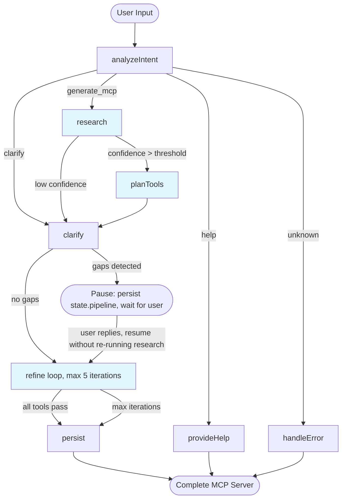

# Architecture Documentation

Technical architecture and design details for MCP Everything.

## Table of Contents
- [System Overview](#system-overview)
- [Backend Architecture](#backend-architecture)
- [Frontend Architecture](#frontend-architecture)
- [Database Design](#database-design)
- [Generation Pipeline](#generation-pipeline)
- [AI Integration](#ai-integration)
- [Communication Patterns](#communication-patterns)
- [Security Architecture](#security-architecture)

## System Overview

MCP Everything uses a modern, AI-first architecture with three main layers:

```
┌─────────────────────────────────────────────────────────┐
│                    Frontend Layer                        │
│  Angular 20 • LibreChat Design • SSE Client • Responsive │
└─────────────────────────────────────────────────────────┘
                            ↓
                         SSE/HTTP
                            ↓
┌─────────────────────────────────────────────────────────┐
│                    Backend Layer                         │
│  NestJS • GenerationPipeline • Claude Sonnet/Haiku •      │
│  GitHub API • Docker-sandboxed validation                │
└─────────────────────────────────────────────────────────┘
                            ↓
                      PostgreSQL
                            ↓
┌─────────────────────────────────────────────────────────┐
│                    Data Layer                            │
│  Conversations • Checkpoints • User Sessions • Generated │
└─────────────────────────────────────────────────────────┘
```

### Core Principles

1. **AI-First**: Natural language understanding over rigid APIs
2. **Conversational**: Multi-turn dialogue with context preservation
3. **Local-First**: Docker builds locally for fast iteration
4. **Type-Safe**: End-to-end TypeScript with strict mode
5. **Scalable**: Designed for growth from MVP to enterprise

## Backend Architecture

### Service Layer Organization

```
packages/backend/src/
├── orchestration/
│   ├── pipeline.service.ts           # GenerationPipeline - the whole flow
│   ├── research.service.ts           # Input-agnostic research
│   ├── refinement.service.ts         # Generate-Test-Refine loop
│   ├── clarification.service.ts      # Gap detection helpers
│   ├── code-execution.service.ts     # Sandboxed code validation
│   └── types.ts                      # Pipeline state types
│
├── ai/
│   ├── anthropic.service.ts          # Single seam to Claude (all model calls)
│   └── anthropic.errors.ts           # Structured error types
│
├── chat/
│   ├── chat.controller.ts            # HTTP/SSE endpoints + stream tickets
│   ├── stream-ticket.service.ts      # Single-use SSE ticket issuance/validation
│   └── chat.module.ts                # Chat module definition
│
├── testing/
│   └── mcp-testing.service.ts        # Docker-sandboxed MCP server validation
│
├── github-analysis.service.ts        # Repository analysis with Octokit (used by ResearchService)
│
├── deployment/                       # Deployment providers (gist, devcontainer, CI workflow, local Docker)
├── hosting/                          # Hosted-server lifecycle
├── marketplace/                      # Marketplace CRUD + AdminGuard
├── auth/                             # JWT auth, guards, password reset
│
├── database/
│   ├── entities/
│   │   ├── conversation.entity.ts    # Conversation, messages, pause/resume state
│   │   ├── pipeline-run.entity.ts    # Per-step observability (replaces old checkpoints)
│   │   ├── deployment.entity.ts
│   │   └── mcp-server.entity.ts      # Marketplace listing
│   ├── migrations/                   # Database migrations
│   └── database.module.ts            # TypeORM configuration
│
└── metrics/                          # Prometheus metrics (ai_calls_total, ai_cost_usd_total, etc.)
```

### Core Services

#### GenerationPipeline
**Purpose**: Orchestrates the full generation flow. Replaced the 8-node LangGraph state machine and the 4-agent ensemble it routed through.

**Key Methods**:
```typescript
class GenerationPipeline {
  // Execute the pipeline with streaming updates; resumes from persisted
  // state if the conversation is paused at `clarify`.
  async *execute(
    conversationId: string,
    userMessage: string
  ): AsyncGenerator<PipelineUpdate>;

  // Steps (run in order; clarify can pause/resume)
  private async analyzeIntent(state: PipelineState): Promise<string>;
  private async research(state: PipelineState): Promise<string>;
  private async planTools(state: PipelineState): Promise<string>;  // replaces the ensemble
  private async clarify(state: PipelineState): Promise<string>;
  private async *refine(state: PipelineState): AsyncGenerator<PipelineUpdate>;
}
```

#### GitHubAnalysisService
**Purpose**: Analyzes GitHub repositories using Octokit (used by ResearchService)

**Key Methods**:
```typescript
class GitHubAnalysisService {
  // Get repository metadata
  async getRepository(url: string): Promise<GitHubRepo>;

  // Analyze repository structure
  async analyzeStructure(repo: GitHubRepo): Promise<RepoAnalysis>;

  // Extract README content
  async getReadme(repo: GitHubRepo): Promise<string>;

  // Get primary language and frameworks
  async detectTechStack(repo: GitHubRepo): Promise<TechStack>;
}
```

#### ResearchService
**Purpose**: Input-agnostic research coordinator supporting 5 input types

**Input Types Supported**:
- GitHub URLs (`https://github.com/owner/repo`)
- Website URLs (`https://example.com`)
- Documentation URLs (`https://docs.example.com/api`)
- Service names (`"Stripe API"`, `"Express.js"`)
- Natural language (`"I need to process payments"`)

**Key Methods**:
```typescript
class ResearchService {
  // Main entry point - classifies input and routes to appropriate strategy
  async conductResearch(state: PipelineState): Promise<ResearchPhase>;

  // Classify user input into one of 5 types
  private async classifyInput(userInput: string): Promise<InputClassification>;

  // Research strategies per input type
  private async researchFromGitHub(githubUrl: string): Promise<ResearchPhase>;
  private async researchFromWebsite(url: string): Promise<ResearchPhase>;
  private async researchFromServiceName(serviceName: string): Promise<ResearchPhase>;
  private async researchFromIntent(intent: string): Promise<ResearchPhase>;
}
```

#### RefinementService
**Purpose**: Generate-Test-Refine loop until all tools work (max 5 iterations)

**Key Methods**:
```typescript
class RefinementService {
  // Main refinement loop
  async refineUntilWorking(state: PipelineState): Promise<RefinementResult>;

  // Generate MCP server code (single structured Claude call, not a separate service)
  private async generateMcpServer(state: PipelineState): Promise<GeneratedCode>;

  // Test generated code with Docker
  private async testGeneratedCode(code: GeneratedCode): Promise<TestResults>;

  // AI-powered failure analysis
  private async analyzeFailures(testResults: TestResults): Promise<FailureAnalysis>;

  // Apply fixes based on analysis
  private async applyFixes(code: GeneratedCode, analysis: FailureAnalysis): Promise<GeneratedCode>;
}
```

#### McpTestingService
**Purpose**: Docker-sandboxed MCP server validation with comprehensive test coverage. `npm install` runs with `--ignore-scripts`, no host environment, and container resource limits. `MCP_TESTING_ALLOW_UNSANDBOXED=true` is an explicit escape hatch for environments without Docker.

**Key Methods**:
```typescript
class McpTestingService {
  // Test MCP server in isolated Docker container
  async testMcpServer(generatedCode: GeneratedCode, options?: TestOptions): Promise<McpServerTestResult>;

  // Individual tool testing
  private async testTool(toolName: string, container: Docker.Container): Promise<ToolTestResult>;

  // Build and validate MCP server
  private async buildInDocker(generatedCode: GeneratedCode): Promise<Docker.Container>;
}
```

#### AnthropicService
**Purpose**: The single seam between the backend and the Anthropic API. One place to configure models, retry/timeout policy, concurrency limits, and token/cost telemetry.

**Key Methods**:
```typescript
class AnthropicService {
  // Free-text completion
  async completeText(options: CompleteTextOptions): Promise<string>;

  // Structured completion validated against a zod/v4 schema
  async completeStructured<T>(options: CompleteStructuredOptions<T>): Promise<T>;
}
```
Model tiers: `default` → `ANTHROPIC_MODEL` (claude-sonnet-5, reasoning/synthesis/codegen), `small` → `ANTHROPIC_SMALL_MODEL` (claude-haiku-4-5, cheap classification/extraction).

### NestJS Module Structure

```typescript
@Module({
  imports: [
    NestConfigModule.forRoot({ isGlobal: true }),
    TypeOrmModule.forRoot(databaseConfig),
    MetricsModule,   // Global metrics - AiModule records token/cost counters here
    AiModule,        // Global - single configured Anthropic client (@Global())
    ChatModule,      // Owns GenerationPipeline + orchestration steps directly
    DeploymentModule,
    ValidationModule,
    UserModule,
    SubscriptionModule,
    HostingModule,
    EmailModule,
    AuthModule,
    MarketplaceModule,
    HealthModule,
  ],
})
export class AppModule {}
```
Note: there is no separate `OrchestrationModule` — `ChatModule` directly provides `GenerationPipeline` and its pipeline-step services (`ResearchService`, `ClarificationService`, `RefinementService`, `CodeExecutionService`).

## Frontend Architecture

### Component Organization

The frontend is **fully standalone Angular 20** — there are no NgModules anywhere in `src/app`. Routing, guards, and HTTP interceptors are all functional (`provideRouter`, `CanActivateFn`, `HttpInterceptorFn`).

```
packages/frontend/src/app/
├── core/
│   ├── services/                     # ChatService, auth service, API clients
│   ├── guards/                       # Functional route guards
│   ├── interceptors/                 # Functional HTTP interceptors (auth, error handling)
│   └── config/
│
├── features/
│   ├── chat/                         # Main chat interface (standalone component)
│   │   └── components/
│   ├── explore/                      # Marketplace browsing, server-detail
│   │   └── server-detail/
│   ├── servers/                      # User's own servers/deployments
│   │   └── components/
│   ├── auth/                         # Login/register/password-reset
│   │   └── components/
│   └── account/                      # User settings
│
├── shared/
│   ├── components/                   # server-card, top-nav, conversation-sidebar, publish-dialog
│   ├── animations/
│   ├── pipes/
│   └── utils/
│
└── app.component.ts                  # Root standalone component
```

### State Management

**ChatService** owns message state and the SSE stream lifecycle using signals — there is no separate `SessionService`/`SseService` split:

```typescript
export class ChatService {
  private readonly baseUrl = API_BASE;

  /** All messages for the currently active conversation. */
  readonly messages = signal<ChatMessage[]>([]);
  /** True while waiting for the assistant's reply to a sent message. */
  readonly isWaiting = signal<boolean>(false);

  // Sending a message: requests a single-use stream ticket, then opens the
  // SSE connection with `?ticket=...` before it expires (60s).
  async sendMessage(conversationId: string, message: string): Promise<void>;

  // Owns EventSource lifecycle: open, message handling, error, and cleanup.
  private connectStream(sessionId: string, ticket: string): void;
  disconnectStream(): void;
}
```

### LibreChat-Inspired Design

**Design System**:
- **Color Palette**: Indigo primary (#3f51b5), light gray background (#fafafa)
- **Typography**: 15px body, 32px headers, 600 font weight
- **Spacing**: 24px gaps, 32px padding (desktop), 16px (mobile)
- **Components**: Minimal, custom-styled, no heavy Material components
- **Responsive**: Mobile-first with 768px breakpoint

**Layout Structure**:
```
┌────────────────────────────────────────┐
│         Top Navigation (64px)          │
│  Logo  |  Model Selector  |  Account   │
├───────────┬────────────────────────────┤
│           │                            │
│ Sidebar   │   Main Chat Area           │
│ (300px)   │   (Centered, max 900px)    │
│           │                            │
│ Convos    │   Messages                 │
│ History   │   ...                      │
│           │   ...                      │
│           │                            │
│           │   Input Box (Fixed Bottom) │
└───────────┴────────────────────────────┘
```

## Database Design

### Schema Overview

```sql
-- Conversations table (now also carries pause/resume pipeline state)
CREATE TABLE conversations (
  id UUID PRIMARY KEY,
  user_id UUID REFERENCES users(id) ON DELETE SET NULL,
  session_id VARCHAR(255) NOT NULL,
  messages JSONB NOT NULL,
  state JSONB,               -- includes state.pipeline, the serialised PipelineState
  current_stage VARCHAR(100),
  created_at TIMESTAMP NOT NULL DEFAULT NOW(),
  updated_at TIMESTAMP NOT NULL DEFAULT NOW(),
  is_active BOOLEAN DEFAULT true,
  INDEX idx_user (user_id),
  INDEX idx_session (session_id)
);

-- Pipeline runs (replaces the old write-only "conversation_memories" checkpoints)
CREATE TABLE pipeline_runs (
  id UUID PRIMARY KEY,
  conversation_id UUID REFERENCES conversations(id) ON DELETE CASCADE,
  step VARCHAR(64) NOT NULL,          -- analyzeIntent | research | planTools | clarify | refine | persist | ...
  status VARCHAR(16) NOT NULL,        -- running | succeeded | failed
  started_at TIMESTAMP NOT NULL,
  finished_at TIMESTAMP,
  duration_ms INTEGER,
  input_summary TEXT,
  output_summary TEXT,
  error TEXT,
  INDEX idx_pipeline_runs_conversation (conversation_id),
  INDEX idx_pipeline_runs_step (step)
);
```

### Entity Relationships

```
Conversation (1) ──── (N) PipelineRun
     │
     └─ user_id: Owner (ownership-checked on every request)
     └─ session_id: Browser session identifier
     └─ messages: Complete conversation history
     └─ state.pipeline: Serialised PipelineState — what makes a paused
        `clarify` step resumable without re-running research

PipelineRun
     └─ step: One of PIPELINE_STEPS (analyzeIntent, research, planTools,
        clarify, refine, persist, provideHelp, handleError)
     └─ status / duration_ms / input_summary / output_summary / error:
        per-step observability — every step of every run is timed and
        recorded, unlike the old write-only checkpoints
```

### Data Flow

```
User Message
    ↓
Create/Update Conversation
    ↓
Execute Pipeline Step (GenerationPipeline)
    ↓
Write PipelineRun row (status, timing, input/output summary)
    ↓
Stream Update to Frontend (SSE, single-use ticket)
    ↓
Update Conversation Messages (+ persist state.pipeline if paused at clarify)
```

## Generation Pipeline

The 8-node LangGraph state machine and the 4-agent ensemble it routed through have been deleted. `GenerationPipeline` (`packages/backend/src/orchestration/pipeline.service.ts`) is a single explicit async-generator method that runs the steps directly — no graph library, no separate node files.

### Step Flow


```mermaid
graph TD
    START([User Input]) --> A[analyzeIntent]
    A -->|generate_mcp| RS[research]
    A -->|clarify| C[clarify]
    A -->|help| G[provideHelp]
    A -->|unknown| H[handleError]

    RS -->|confidence > threshold| PT[planTools]
    RS -->|low confidence| C
    PT --> C
    C -->|gaps detected| PAUSE([Pause: persist state.pipeline, wait for user])
    C -->|no gaps| RF[refine loop, max 5 iterations]
    PAUSE -->|user replies, resume without re-running research| RF
    RF -->|all tools pass| P[persist]
    RF -->|max iterations| P
    P --> END([Complete MCP Server])
    G --> END
    H --> END

    style RS fill:#e1f5ff
    style PT fill:#e1f5ff
    style RF fill:#e1f5ff
```

### State Definition

```typescript
// packages/backend/src/orchestration/types.ts
export const PIPELINE_STEPS = [
  'analyzeIntent', 'research', 'planTools', 'clarify',
  'refine', 'persist', 'provideHelp', 'handleError',
] as const;

interface PipelineState {
  sessionId: string;
  conversationId?: string;
  messages: Array<{ role: 'user' | 'assistant' | 'system'; content: string; timestamp: Date }>;
  userInput: string;

  intent?: {
    type: 'generate_mcp' | 'clarify' | 'research' | 'help' | 'unknown';
    confidence: number;
    reasoning?: string;
  };

  extractedData?: {
    githubUrl?: string;
    repositoryName?: string;
    apiSpecUrl?: string;
    customRequirements?: string[];
    targetFramework?: string;
  };

  // Step: research
  researchPhase?: {
    synthesizedPlan: SynthesizedPlan;
    researchConfidence: number;
    researchIterations: number;
    // + optional web/GitHub/API-doc deep-dive results
  };

  // Step: planTools — the plan the refine loop generates code from
  generationPlan?: {
    steps: string[];
    toolsToGenerate: Array<{ name: string /* ... */ }>;
  };
}
```

### GenerationPipeline.execute()

```typescript
// packages/backend/src/orchestration/pipeline.service.ts
class GenerationPipeline {
  async *execute(conversationId: string, userInput: string): AsyncGenerator<PipelineUpdate> {
    // Resuming? Skip straight to planTools; research is NOT re-run.
    // Otherwise: analyzeIntent -> research -> planTools -> clarify -> refine -> persist
    ...
  }

  private async analyzeIntent(state: PipelineState): Promise<string> {
    // Single structured Claude call (small tier) classifying intent
  }

  private async research(state: PipelineState): Promise<string> {
    state.researchPhase = await this.researchService.conductResearch(state);
    ...
  }

  // Replaces the deleted 4-agent ensemble: one structured call that turns
  // research findings into the concrete tool set the refine loop generates from.
  private async planTools(state: PipelineState): Promise<string> { ... }
}
```

## AI Integration

### AnthropicService Configuration

```typescript
// packages/backend/src/ai/anthropic.service.ts — the single seam to Claude
const DEFAULTS = {
  model: 'claude-sonnet-5',       // ANTHROPIC_MODEL — reasoning, synthesis, code generation
  smallModel: 'claude-haiku-4-5', // ANTHROPIC_SMALL_MODEL — cheap classification/extraction
  maxConcurrency: 4,
  timeoutMs: 120_000,
  maxRetries: 3,
  maxTokens: 8_192,
};

// Structured outputs are validated against a zod/v4 schema:
await anthropicService.completeStructured({
  prompt,
  schema: IntentSchema,     // z.ZodType, built with `zod/v4`
  schemaName: 'Intent',
  model: 'small',
  caller: 'pipeline.analyzeIntent',
});
```

### Cost Optimization

- **Model Selection**: claude-haiku-4-5 for classification/extraction, claude-sonnet-5 for reasoning/synthesis/codegen
- **Telemetry**: every call records tokens and cost into Prometheus (`ai_calls_total`, `ai_tokens_total`, `ai_cost_usd_total`) — pricing table is per-million-token, matched by model-id prefix
- **Observed cost**: ~$0.22 tracked cost for a full pipeline run (analyzeIntent → research → planTools → refine)
- **Retries**: up to 3 retries with structured-output validation before surfacing a `SchemaValidationError`/`TruncatedResponseError`

## Communication Patterns

### Server-Sent Events (SSE)

SSE connections require a single-use, 60-second stream ticket obtained from an authenticated endpoint — an `EventSource` can't send an `Authorization` header, so a bearer JWT can't protect the stream directly.

**Backend Streaming**:
```typescript
// 1. Authenticated: issue a short-lived ticket
@Post('stream-ticket')
createStreamTicket(@CurrentUser() user: User, @Body() dto: CreateStreamTicketDto): StreamTicketResponseDto {
  return this.streamTicketService.issue(user.id, dto.sessionId);
}

// 2. The SSE endpoint itself validates the ticket (single use, 60s window)
@Sse('stream/:sessionId')
async streamUpdates(
  @Param('sessionId') sessionId: string,
  @Query('ticket') ticket: string,
): Observable<MessageEvent> {
  this.streamTicketService.validateAndConsume(ticket, sessionId);

  return new Observable(observer => {
    const pipelineStream = this.pipeline.execute(conversationId, userMessage);

    (async () => {
      for await (const update of pipelineStream) {
        observer.next({ data: JSON.stringify(update) });
      }
      observer.complete();
    })();
  });
}
```

**Frontend Consumption**:
```typescript
// ChatService requests a ticket, then opens the stream before it expires
const { ticket } = await this.http.post(`${API_BASE}/api/chat/stream-ticket`, { sessionId });
const eventSource = new EventSource(`${API_BASE}/api/chat/stream/${sessionId}?ticket=${ticket}`);

eventSource.onmessage = (event) => {
  const update: StreamUpdate = JSON.parse(event.data);
  this.handleUpdate(update);
};
```

### Message Types

```typescript
type StreamUpdate =
  | { type: 'progress'; node: string; message: string }
  | { type: 'result'; data: any }
  | { type: 'complete'; success: boolean }
  | { type: 'error'; error: string };
```

## Security Architecture

### Authentication and Ownership

A global JWT guard (`APP_GUARD` in `app.module.ts`) protects every route by default; routes are opted *out* of auth individually with `@Public()`. This replaced a model where most endpoints were unauthenticated.

```typescript
// packages/backend/src/app.module.ts
{
  provide: APP_GUARD,
  useClass: JwtAuthGuard,
}
// Use @Public() to explicitly exempt a route (e.g. health checks, login/register)
```

Every conversation, deployment, and hosted-server lookup is scoped to `userId` — not just gated by "is logged in." The 5 previously unauthenticated debug endpoints (`POST /chat`, `/analyze`, `/discover-tools`, `/generate-mcp`, `/generate`) have been deleted entirely.

### API Key Management

```typescript
// Environment-based configuration
const config = {
  anthropicApiKey: process.env.ANTHROPIC_API_KEY,
  githubToken: process.env.GITHUB_TOKEN,
};

// Validation on startup
if (!config.anthropicApiKey?.startsWith('sk-ant-')) {
  throw new Error('Invalid Anthropic API key');
}
```

### Input Validation

```typescript
// NestJS DTO validation
export class ChatMessageDto {
  @IsString()
  @MinLength(1)
  @MaxLength(5000)
  message: string;

  @IsOptional()
  @IsUUID()
  conversationId?: string;
}
```

### Generated-Code Execution Safety

The primary sandbox for full generated MCP servers is Docker, run by `McpTestingService` (`packages/backend/src/testing/`):

- `npm install` runs with `--ignore-scripts` to block malicious install hooks
- No host environment variables are passed into the container
- Resource limits: `--cpus=0.5 --memory=512m --pids-limit=64`, `--network=none`, `--read-only`, `--cap-drop=ALL`, `--security-opt=no-new-privileges`
- `MCP_TESTING_ALLOW_UNSANDBOXED=true` is an explicit escape hatch for environments where Docker itself is unavailable — it is off by default and logged loudly when used

`CodeExecutionService` additionally uses `isolated-vm` for lightweight snippet-level validation:

```typescript
class CodeExecutionService {
  async executeCode(context: CodeExecutionContext): Promise<CodeExecutionResult> {
    const isolate = new ivm.Isolate({ memoryLimit: context.memoryLimit ?? 128 });
    // ... run with a fresh isolated context, capture console output, enforce timeout
  }
}
```

### Rate Limiting

Global throttling (`@nestjs/throttler`) and `helmet` security headers are applied at the application level; SSE connections are exempted from throttling with `@SkipThrottle()` since they are long-lived by design.

## Performance Considerations

### Caching Strategy

```typescript
// Repository analysis cache (24 hours)
@Cacheable({ ttl: 86400 })
async analyzeRepository(url: string): Promise<RepoAnalysis> {
  return this.githubService.analyzeStructure(url);
}
```
Note: the earlier "tool discovery cache" no longer applies — `ToolDiscoveryService` was deleted; tool planning now happens inline in the `planTools` pipeline step.

### Database Optimization

- **Indexes**: `userId` and `sessionId` on `conversations`; `conversationId` and `step` on `pipeline_runs`
- **JSONB**: Efficient JSON storage and querying (`conversations.messages`, `conversations.state`)
- **Cascading Deletes**: Automatic cleanup of related records
- **Connection Pooling**: Reuse database connections

### Frontend Optimization

- **Lazy Loading**: Standalone components lazy-loaded per route via `loadComponent` (no NgModules)
- **Change Detection**: OnPush strategy for components
- **Virtual Scrolling**: For long conversation histories
- **Bundle Splitting**: Separate chunks per route

## Deployment Architecture

### Docker Structure

```
Base Images (Pre-built):
├── node-alpine (150MB) - TypeScript MCP servers
├── node-slim (120MB) - JavaScript MCP servers
└── python-alpine (100MB) - Python MCP servers

Generation flow:
Input → analyzeIntent → research → planTools → clarify → refine (Docker build+test) → persist
```

Each generated server now emits its own `Dockerfile` and `.dockerignore` (previously optional); `GENERATED_SERVERS_DIR` configures where output is written on disk, and `Deployment` records persist `serverName`/`localPath` for later redeploy. `.github/workflows/deploy.yml` builds and pushes `:latest` for the backend/frontend images on every push to `main`.

**Unvalidated**: Kubernetes manifests exist under `k8s/` (base + overlays for production/development, monitoring stack, cert-manager, ingress) and CI publishes images, but the actual cloud/k8s deploy path has not been exercised end-to-end.

### Environment Configuration

```typescript
// Multi-environment support
const config = {
  development: {
    apiUrl: 'http://localhost:3000',
    logLevel: 'debug',
  },
  production: {
    apiUrl: 'https://api.mcp-everything.com',
    logLevel: 'info',
  },
};
```

## Monitoring and Observability

### Performance Metrics

Real Prometheus metrics exported by `MetricsService` (`packages/backend/src/metrics/`):

```typescript
// Generation pipeline
mcp_generation_total            // Counter
mcp_generation_duration_seconds // Histogram
mcp_generation_errors_total     // Counter
mcp_active_conversations        // Gauge

// API
mcp_api_requests_total          // Counter
mcp_api_latency_seconds         // Histogram

// Business
mcp_users_total                 // Gauge
mcp_deployments_total           // Counter
mcp_marketplace_downloads_total // Counter

// AI cost/token telemetry (written by AnthropicService on every call)
ai_calls_total                  // Counter
ai_tokens_total                 // Counter
ai_cost_usd_total                // Counter — ~$0.22 observed per full generation
```
Grafana dashboards and alert rules live under `k8s/monitoring/`; see `docs/runbooks/` for the corresponding operational runbooks.

### Health Checks

```typescript
@Get('health')
async healthCheck(): Promise<HealthStatus> {
  return {
    status: 'healthy',
    database: await this.checkDatabase(),
    ai: await this.checkAnthropicAPI(),
    github: await this.checkGitHubAPI(),
  };
}
```

## Future Architecture Considerations

- **Horizontal Scaling**: Redis for distributed state management
- **Message Queues**: Bull/BullMQ for background processing
- **Microservices**: Split generation into separate service
- **CDN**: Static assets and frontend distribution
- **Rate Limiting**: Per-user and global rate limits
- **Webhooks**: GitHub webhook integration for automatic updates
