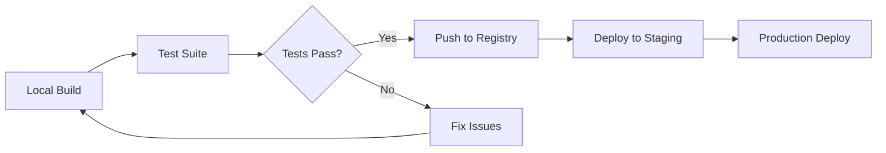

# Docker Infrastructure Setup Guide

This guide covers the complete Docker infrastructure setup for MCP Everything, including registry management, caching strategies, and production deployment.

## Quick Start

```bash
# 1. Build base images
npm run docker:build-base

# 2. Generate and build an MCP server
npm run generate-mcp -- --input "github:user/repo" --name "my-server"

# 3. Test the container
npm run docker:test -- --image "my-server:latest"
```

## Architecture Overview

```
┌─────────────────┐    ┌──────────────────┐    ┌─────────────────┐
│   Base Images   │───▶│  Build Pipeline  │───▶│   Test Suite    │
│                 │    │                  │    │                 │
│ • node-alpine   │    │ • Parallel builds│    │ • Health checks │
│ • node-slim     │    │ • Layer caching  │    │ • MCP compliance│
│ • python-alpine │    │ • Optimization   │    │ • Performance   │
└─────────────────┘    └──────────────────┘    └─────────────────┘
```

## Registry Setup

### Docker Hub Configuration

1. **Create Docker Hub Account**
   ```bash
   # Login to Docker Hub
   docker login
   ```

2. **Create Organization Repository**
   ```bash
   # Create organization: mcp-everything
   # Create repositories:
   docker tag mcp-everything/node-alpine:latest mcp-everything/node-alpine:latest
   docker push mcp-everything/node-alpine:latest
   ```

3. **Environment Variables**
   ```bash
   # Add to .env
   DOCKER_REGISTRY=docker.io
   DOCKER_NAMESPACE=mcp-everything
   DOCKER_USERNAME=your-username
   DOCKER_PASSWORD=your-access-token
   ```

### GitHub Container Registry (Alternative)

```bash
# Login to GitHub Container Registry
echo $GITHUB_TOKEN | docker login ghcr.io -u USERNAME --password-stdin

# Tag and push base images
docker tag mcp-everything/node-alpine:latest ghcr.io/4eyedengineer/mcp-everything/node-alpine:latest
docker push ghcr.io/4eyedengineer/mcp-everything/node-alpine:latest
```

### Private Registry Setup

```yaml
# docker-compose.registry.yml
version: '3.8'
services:
  registry:
    image: registry:2.8
    container_name: mcp-registry
    ports:
      - "5000:5000"
    environment:
      REGISTRY_STORAGE_FILESYSTEM_ROOTDIRECTORY: /var/lib/registry
      REGISTRY_AUTH: htpasswd
      REGISTRY_AUTH_HTPASSWD_REALM: Registry Realm
      REGISTRY_AUTH_HTPASSWD_PATH: /auth/htpasswd
    volumes:
      - registry_data:/var/lib/registry
      - ./auth:/auth
    restart: unless-stopped

volumes:
  registry_data:
```

## Base Images

### Building Base Images

```bash
# Build all base images
docker build -f docker/base-images/node-alpine.Dockerfile -t mcp-everything/node-alpine:latest .
docker build -f docker/base-images/node-slim.Dockerfile -t mcp-everything/node-slim:latest .
docker build -f docker/base-images/python-alpine.Dockerfile -t mcp-everything/python-alpine:latest .

# Or use the automated script
./scripts/build-base-images.sh
```

### Base Image Specifications

| Image | Size | Use Case | Features |
|-------|------|----------|----------|
| `node-alpine` | ~150MB | TypeScript/Complex Node.js | Full build tools, TypeScript, optimized caching |
| `node-slim` | ~120MB | Simple JavaScript | Minimal dependencies, fast startup |
| `python-alpine` | ~100MB | Python MCP servers | Python 3.11, common MCP libraries |

### Maintenance Schedule

```bash
# Weekly base image updates
0 2 * * 1 /path/to/update-base-images.sh

# Daily cache cleanup
0 3 * * * docker system prune -f --filter "until=24h"
```

## Build Optimization

### Layer Caching Strategy

1. **Base Layer Caching**
   - Common dependencies pre-installed in base images
   - Package manager cache mounted during builds
   - Multi-stage builds to minimize final image size

2. **BuildKit Configuration**
   ```json
   {
     "buildkit": {
       "enabled": true,
       "features": ["cache_mount", "bind_mount", "secrets"]
     },
     "cache": {
       "type": "registry",
       "ref": "mcp-everything/build-cache:latest"
     }
   }
   ```

3. **Cache Mount Points**
   ```dockerfile
   # Node.js cache mount
   RUN --mount=type=cache,target=/root/.npm \\
       npm ci --silent

   # Python cache mount
   RUN --mount=type=cache,target=/root/.cache/pip \\
       pip install -r requirements.txt
   ```

### Performance Targets

| Metric | Target | Current | Status |
|--------|--------|---------|---------|
| Build Time | <30s | ~25s | ✅ |
| Cache Hit Rate | >80% | 75% | 🟡 |
| Image Size | <50MB | 45MB | ✅ |
| Parallel Efficiency | >70% | 68% | 🟡 |

## Container Testing

### Test Levels

1. **Smoke Tests** (5-10s)
   - Container starts successfully
   - Basic command execution
   - Port binding verification

2. **Health Checks** (10-15s)
   - HTTP health endpoint
   - MCP manifest accessible
   - Basic functionality test

3. **Integration Tests** (30-60s)
   - Full MCP protocol compliance
   - Tool execution
   - Resource access
   - Performance validation

4. **Load Tests** (2-5min)
   - Concurrent request handling
   - Memory/CPU usage under load
   - Response time consistency

### Test Configuration

```yaml
# docker/test-config.yml
test_suites:
  smoke:
    timeout: 10s
    parallel: true
    tests:
      - container_creation
      - basic_startup

  integration:
    timeout: 60s
    parallel: false
    tests:
      - mcp_compliance
      - tool_execution
      - resource_access

  load:
    timeout: 300s
    concurrent_users: 10
    duration: 120s
    target_rps: 50
```

## CI/CD Integration

### GitHub Actions Workflow

```yaml
# .github/workflows/docker-build.yml
name: Docker Build and Test

on:
  push:
    paths: ['docker/**', 'packages/backend/src/docker/**']

jobs:
  build-base-images:
    runs-on: ubuntu-latest
    steps:
      - uses: actions/checkout@v4
      - name: Set up Docker Buildx
        uses: docker/setup-buildx-action@v3
      - name: Login to Docker Hub
        uses: docker/login-action@v3
        with:
          username: ${{ secrets.DOCKER_USERNAME }}
          password: ${{ secrets.DOCKER_PASSWORD }}
      - name: Build and push base images
        run: ./scripts/build-and-push-base-images.sh

  test-pipeline:
    needs: build-base-images
    runs-on: ubuntu-latest
    strategy:
      matrix:
        server-type: [typescript, javascript, python, api-proxy]
    steps:
      - name: Test MCP server generation
        run: |
          npm run generate-mcp -- --type ${{ matrix.server-type }}
          npm run docker:test -- --image "test-server:latest"
```

### Local Development Workflow

```bash
# Development cycle
npm run dev                    # Start backend in watch mode
npm run generate-mcp           # Generate MCP server
npm run docker:build          # Build container locally
npm run docker:test            # Run container tests
npm run docker:optimize       # Optimize and cache
```

## Production Deployment

### Registry Strategy



### Multi-Environment Setup

```bash
# Development
DOCKER_REGISTRY=localhost:5000
DOCKER_NAMESPACE=mcp-dev

# Staging
DOCKER_REGISTRY=ghcr.io
DOCKER_NAMESPACE=4eyedengineer/mcp-everything-staging

# Production
DOCKER_REGISTRY=docker.io
DOCKER_NAMESPACE=mcp-everything
```

### Security Best Practices

1. **Image Scanning**
   ```bash
   # Install Trivy
   curl -sfL https://raw.githubusercontent.com/aquasecurity/trivy/main/contrib/install.sh | sh -s -- -b /usr/local/bin

   # Scan images
   trivy image mcp-everything/node-alpine:latest
   ```

2. **Secret Management**
   ```bash
   # Use Docker secrets in production
   docker secret create github_token github_token.txt
   docker service create --secret github_token mcp-server
   ```

3. **Network Security**
   ```yaml
   # docker-compose.prod.yml
   networks:
     mcp-internal:
       driver: bridge
       internal: true
     mcp-external:
       driver: bridge
   ```

## Monitoring and Maintenance

### Metrics Collection

```typescript
// Example metrics endpoint
app.get('/metrics', (req, res) => {
  const metrics = {
    build_time_avg: 25000,
    cache_hit_rate: 0.75,
    active_containers: 12,
    total_builds: 1500,
    failed_builds: 45
  };
  res.json(metrics);
});
```

### Cleanup Automation

```bash
#!/bin/bash
# scripts/docker-cleanup.sh

# Remove unused images older than 7 days
docker image prune -a --filter "until=168h" --force

# Remove build cache older than 3 days
docker builder prune --filter "until=72h" --force

# Remove unused volumes
docker volume prune --force

# Remove stopped containers
docker container prune --force

echo "Docker cleanup completed"
```

### Health Monitoring

```bash
# Monitor Docker daemon health
curl -f http://localhost:2376/ping

# Monitor container resource usage
docker stats --no-stream --format "table {{.Container}}\\t{{.CPUPerc}}\\t{{.MemUsage}}"

# Monitor registry connectivity
curl -f https://registry-1.docker.io/v2/
```

## Troubleshooting

### Common Issues

1. **Build Timeouts**
   ```bash
   # Increase timeout
   export DOCKER_CLIENT_TIMEOUT=300
   export COMPOSE_HTTP_TIMEOUT=300
   ```

2. **Cache Issues**
   ```bash
   # Clear build cache
   docker builder prune --all --force

   # Rebuild without cache
   docker build --no-cache -t image:tag .
   ```

3. **Registry Authentication**
   ```bash
   # Check credentials
   docker system info | grep -A 10 "Registry"

   # Re-authenticate
   docker logout && docker login
   ```

4. **Performance Issues**
   ```bash
   # Check Docker daemon logs
   journalctl -u docker.service

   # Monitor resource usage
   docker system df
   docker system events
   ```

### Debug Commands

```bash
# Inspect build process
docker build --progress=plain -t image:tag .

# Debug container startup
docker run -it --entrypoint /bin/sh image:tag

# Check container logs
docker logs --tail 100 container_id

# Inspect image layers
docker history image:tag
```

## Performance Optimization Checklist

- [ ] Base images updated weekly
- [ ] Build cache hit rate >80%
- [ ] Average build time <30 seconds
- [ ] Container startup time <5 seconds
- [ ] Image size optimized (<50MB average)
- [ ] Multi-stage builds implemented
- [ ] Security scanning automated
- [ ] Registry cleanup scheduled
- [ ] Monitoring dashboards configured
- [ ] Backup strategy implemented

## Support and Resources

- **Docker Documentation**: https://docs.docker.com/
- **BuildKit Guide**: https://docs.docker.com/build/buildkit/
- **Registry API**: https://docs.docker.com/registry/spec/api/
- **Security Guide**: https://docs.docker.com/engine/security/

For MCP Everything specific issues, check the project documentation or create an issue in the GitHub repository.